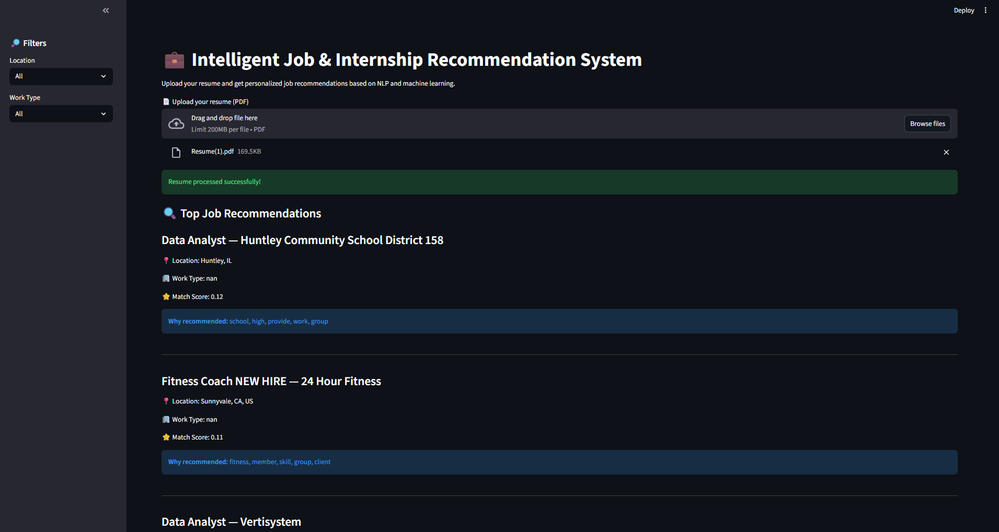
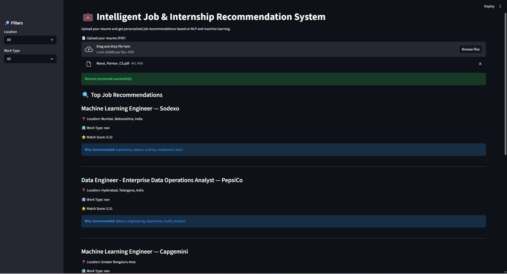

# Intelligent Job & Internship Recommendation System

## Overview
This project is an end-to-end **Data Science and NLP-based job recommendation system** that matches a candidate’s resume with relevant job and internship opportunities.

The system simulates the core logic of an **Applicant Tracking System (ATS)** by analyzing resume content and job descriptions using Natural Language Processing, computing similarity scores, and ranking jobs based on relevance.

The focus of this project is **clarity, explainability, and real-world relevance**, rather than black-box models.

---

## Problem Statement
Job portals often overwhelm candidates with irrelevant opportunities, while recruiters struggle to filter suitable applicants efficiently.

This project addresses both sides by:
- Understanding resume content semantically
- Matching it with job descriptions
- Ranking opportunities based on relevance
- Filtering results using user preferences (location, work type)

---

## Key Features
- Resume PDF parsing and text extraction
- NLP-based text preprocessing (lemmatization, stopword removal)
- TF-IDF vectorization for feature representation
- Cosine similarity for resume–job matching
- Weighted ranking logic using:
  - Semantic similarity
  - Skill overlap
  - Experience indicators
- Resume spam detection using a simple ML classifier
- Fake job posting detection using text classification
- Filters for:
  - Location
  - Work type (Remote / Hybrid / Onsite)
- Graceful handling of edge cases (no matching results)

---

## Tech Stack
- **Python**
- **Pandas, NumPy**
- **scikit-learn**
- **spaCy**
- **NLTK**
- **pdfplumber**
- **Google Colab** (development & experimentation)

---

## System Workflow
1. Resume PDF is uploaded and parsed into raw text
2. Resume text is cleaned using NLP preprocessing
3. Job descriptions are cleaned using the same pipeline
4. Resume and job texts are converted into TF-IDF vectors
5. Cosine similarity scores are computed
6. Jobs are ranked using a weighted scoring mechanism
7. Optional filters are applied to refine recommendations
8. Spam resumes and fake job postings are detected using ML classifiers

---

## Why This Project Matters
This project demonstrates:
- Practical application of NLP in hiring systems
- Clean and reusable data preprocessing pipelines
- Explainable recommendation logic
- Handling of noisy, real-world text data
- A balance between ML intelligence and system simplicity

---

## 📸 Application Screenshots

# Home & Resume Upload

# Job Recommendations with Explainability

## Future Improvements
- Skill ontology–based matching
- Experience-level estimation
- Streamlit-based interactive UI
- Backend API using FastAPI
- Model evaluation using ranking metrics

---

## Author
**Swara Berde** 
 Aspiring Data Science Student | Python | Data analysis | Data Science

